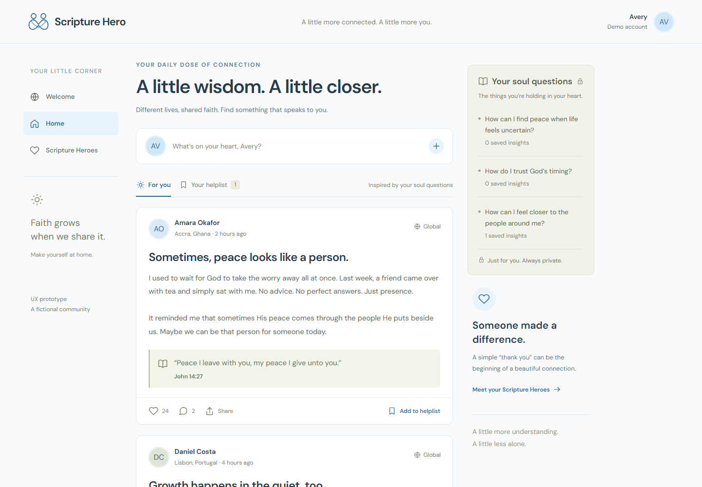
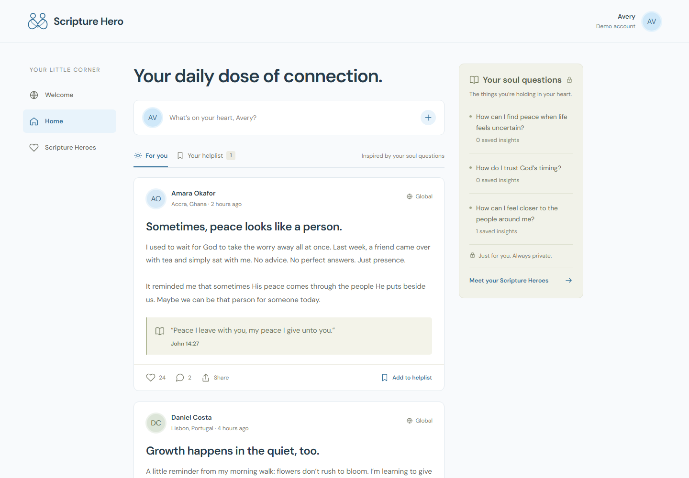

# Scripture Hero — First Three Screens

Scripture Hero is a non-denominational community for sharing spiritual experiences and finding wisdom in the experiences of others.

## Need, persona, capability, and value

| Concept | Definition |
| --- | --- |
| **Need** | People seeking or sharing spiritual insight use group chats or social media, or wait for church. Those workarounds interrupt unrelated conversations, feel performative, or delay sharing. |
| **Persona** | A religious or spiritually curious adult who reflects on personal questions, learns from lived experience, and currently shares through family chats, Instagram, or church. |
| **Primary capability** | Find and share personal spiritual insights with people beyond one’s usual circle. |
| **Fundamental value** | **Connection:** feel understood and learn from people one would not otherwise meet. |

## The three screens

| Screen | Single job and why it earned a slot | Design question |
| --- | --- | --- |
| **Welcome** | Signal the capability and value, then lead into the community. It establishes purpose before feature detail. | After five seconds, will a visitor understand “share spiritual experience and learn through connection” and know where to begin? |
| **Home** | Let a person browse, share, and save relevant insights. It shows the primary capability in action. | Do the feed, post actions, and private Soul Questions form one understandable workflow? |
| **Scripture Heroes** | Show the outcome of helping and being helped through gratitude and optional connection. It makes the value tangible. | Can a person tell who helped whom, what stays private, and what to do next? |

## Design-question plan

These are predictions for a later evaluation, not findings.

| Area | Question for the participant | Prediction and prototype evidence |
| --- | --- | --- |
| **Need** | When you want to share a spiritual thought—or need one—what do you use now, and what frustrates you? | They will mention chats, Instagram, or church and awkward timing/context. Home tests a dedicated, always-available context. |
| **Value** | If this worked well, what one or two words describe its value to you? Why? | They will say **connection** and **learning**, based on the worldwide feed and the gratitude loop on Heroes. |
| **Persona** | How often does this come up, and what are you usually doing when it does? | It will arise between gatherings while texting or using social media. The mobile-first feed and composer assume everyday use. |
| **Capability** | What would you select first, and what do you expect to happen? | **Find your community** will be first because it is the only filled CTA. Its wording may imply profiles/groups although it opens the feed, testing the accuracy of its signal. |

## Design justification and first read

- **First-glance signal:** The connected-souls logo, community photo, dominant “Learn through connection” headline, and single filled CTA signal connection before close reading. The supporting sentence names sharing and finding wisdom.
- **Landing focus:** The AI repeated the promise in an eyebrow, explanatory lines, and footer copy. I removed repetitions and reduced the principles to scannable labels, strengthening hierarchy around the headline and CTA.
- **Gestalt grouping:** On Welcome, proximity groups the headline, capability, and CTA. On Home, common region defines each post and the tinted private-question panel. On Heroes, similarity groups impact measures and repeated person cards; tabs separate the two relationship types.
- **Mission and navigation:** Home demonstrates finding and sharing insight; Heroes demonstrates the resulting connection. Desktop and mobile navigation both include **Welcome**.
- **Important revision:** Repeated slogans and secondary panels competed with the feed. I reduced Home to one heading, removed decorative rail copy, folded the useful Heroes link into the sticky Soul Questions card, and simplified the Heroes heading. The five-second capability question motivated the clearer hierarchy; proximity and common region motivated the consolidated panel.

## Before and after

| Before: blue-color commit | After: meaningful revision |
| --- | --- |
|  |  |
| [`e038270` — color switch to blue](https://github.com/camdenntaylor/ScriptureHero/commit/e038270) | [`9d306fb` — meaningful change](https://github.com/camdenntaylor/ScriptureHero/commit/9d306fb) |

The revision fixes a **visual-hierarchy and competing-signals problem**: the earlier screen gave repeated slogans and secondary panels too much weight. The revised screen makes the feed primary and consolidates related private-question information and navigation through **proximity** and **common region**.
